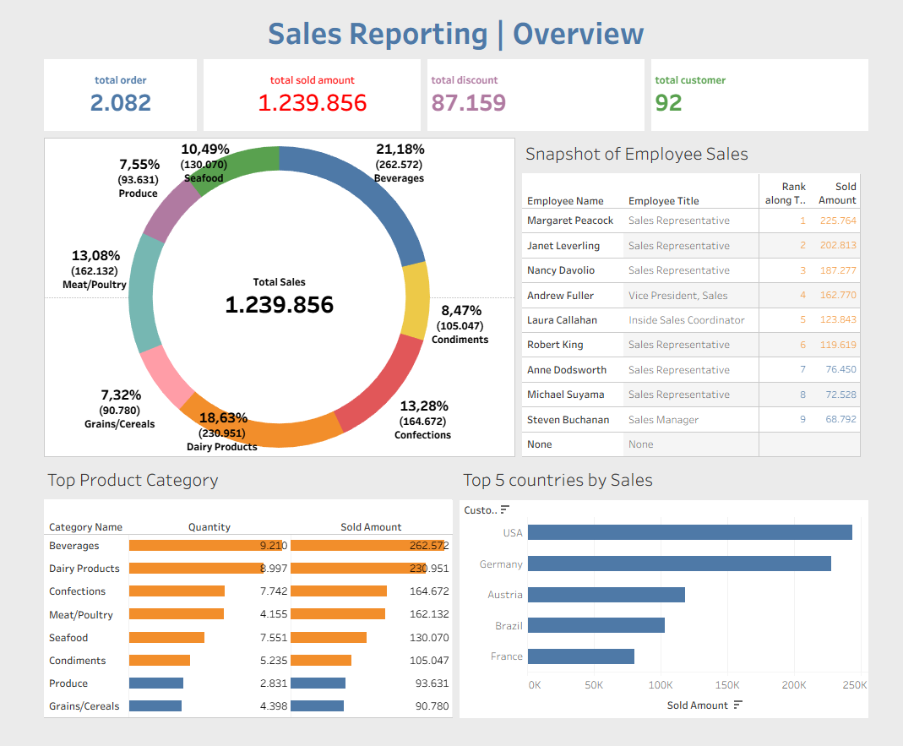

# Northwind Sales Dashboard

## Project Overview

This project analyzes sales performance using the Northwind Data Warehouse.

The dashboard provides insights into:

- Total Sold Amount
- Total Orders
- Total Discound
- Total Customer
- Product Category Performance
- Employee Sales Ranking
- Top Countries by Sales

---

## Dashboard Preview

---

## Tableau Dashboard

View the interactive dashboard here:

[Tableau Public Dashboard](https://public.tableau.com/views/NorthwindSalesDashboard_17794349296020/Dashboard12?:language=en-US&:sid=&:redirect=auth&:display_count=n&:origin=viz_share_link)

---

## Data Model

This project uses a star schema data warehouse model.

### Fact Table

- [northwind].[FactSales]

### Dimension Tables

- [northwind].[DimCustomer]
- [northwind].[DimDate]
- [northwind].[DimProduct]
- [northwind].[DimEmployee]

### Schema Diagram

## Key Insights

- Beverages generated the highest sales contribution.
- USA was the top-performing country.
- Margaret Peacock achieved the highest sales among employees.
- Total sales reached 1.24 million.

---

## Tools Used

- SQL Server
- Tableau Public
- Data Warehouse (Star Schema)

---

## Author

Ade Yohana Azeka Siahaan

LinkedIn: [LINKEDIN](https://www.linkedin.com/in/adesiahaan/)

Tableau Public: [TABLEAU_PROFILE](https://public.tableau.com/app/profile/adesiahaan/vizzes)
