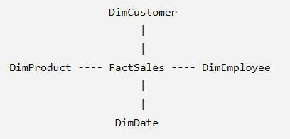
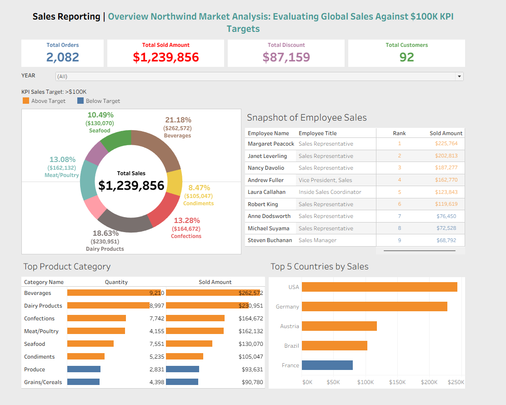

# Northwind Traders: Sales Performance & KPI Analysis

## 📌 Project Overview & Business Value
Developed a comprehensive Business Intelligence dashboard to monitor global sales performance, evaluate employee productivity, and track product category success against established KPI targets. 

**Interactive Dashboard:** [Masukkan Tautan Tableau Public Anda Di Sini]

## 🏗️ Data Architecture
This project is powered by a robust **Star Schema Data Warehouse** model built in SQL Server, ensuring optimized query performance for the dashboard.
*   **Fact Table:** `[northwind].[FactSales]`
*   **Dimension Tables:** `[northwind].[DimCustomer]`, `[northwind].[DimDate]`, `[northwind].[DimProduct]`, `[northwind].[DimEmployee]`
*   **
### Dashboard Preview

### Tableau Dashboard

View the interactive dashboard here:

[Tableau Public Dashboard](https://public.tableau.com/views/Northwind_Sales_KPI_Performance_Analysis/DashboardSalesReporting?:language=en-US&:sid=&:redirect=auth&:display_count=n&:origin=viz_share_link)

## 📊 Key Analytical Insights 
1.  **KPI-Driven Performance (The $100K Threshold):** Applied rigorous conditional logic where revenue > $100K is classified as 'Above Target' (Orange). This highlighted that while *Beverages* ($262K) are revenue drivers, categories like *Produce* ($93K) require immediate intervention.
2.  **Market Dominance & Anomalies:** The USA and Germany markets comfortably exceeded the $100K threshold, whereas France underperformed, signaling a need for localized sales strategy adjustments.
3.  **Data Quality & UX:** Executed Data Source Filters to eliminate critical anomalies (e.g., '1900' default years, 'None' employee values) and optimized the data-ink ratio for executive reading.

## 🛠️ Technical Stack
*   **Database & Modeling:** SQL Server, Data Warehouse (Star Schema)
*   **Visualization & Analytics:** Tableau Public

## 👤 Author
**Ade Yohana Azeka Siahaan**
*   LinkedIn: [Tautkan URL LinkedIn Anda Di Sini]
*   Tableau Public: [Tautkan URL Tableau Profile Anda Di Sini]

## Dashboard Preview

---

## Tableau Dashboard

View the interactive dashboard here:

[Tableau Public Dashboard](https://public.tableau.com/views/NorthwindSalesDashboard_17794349296020/Dashboard12?:language=en-US&:sid=&:redirect=auth&:display_count=n&:origin=viz_share_link)

---

## Data Model

This project uses a star schema data warehouse model.

### Fact Table

- [northwind].[FactSales]

### Dimension Tables

- [northwind].[DimCustomer]
- [northwind].[DimDate]
- [northwind].[DimProduct]
- [northwind].[DimEmployee]

### Schema Diagram

## Key Insights

- Beverages generated the highest sales contribution.
- USA was the top-performing country.
- Margaret Peacock achieved the highest sales among employees.
- Total sales reached 1.24 million.

---

## Tools Used

- SQL Server
- Tableau Public
- Data Warehouse (Star Schema)

---

## Author

Ade Yohana Azeka Siahaan

LinkedIn: [LINKEDIN](https://www.linkedin.com/in/adesiahaan/)

Tableau Public: [TABLEAU_PROFILE](https://public.tableau.com/app/profile/adesiahaan/vizzes)
